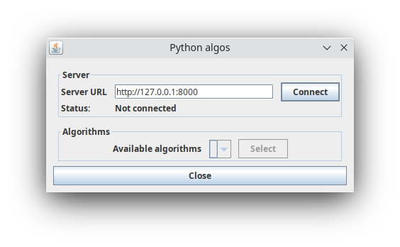
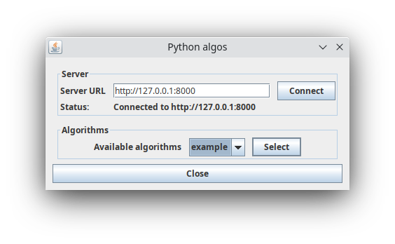
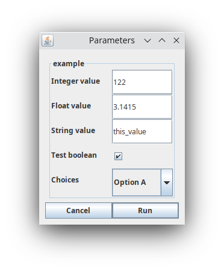

# ij-plugin-pyalgos

This is an ImageJ/Fiji plugin to run Python-based image processing algorithms, in combination with the Python
API [api-py-algos](https://github.com/EPFL-Center-for-Imaging/api-py-algos).
The algorithms are fully defined in the Python API; the plugin provides a user interface to process images using Python algorithms within the ImageJ/Fiji software.

The API is suitable for image-to-image algorithms:

- The input image is either the full 2D image from the selected window, or only the rectangular selection if there is
  one.
- The required parameters are defined in the Python API, and are set by the user in the ImageJ/Fiji user interface.
- The output is a 2D image displayed in ImageJ/Fiji.

### Installation

For the setup of the Python server, see [api-pyalgos](https://github.com/EPFL-Center-for-Imaging/api-py-algos?tab=readme-ov-file#setup).

For the plugin, 
drag and drop the latest version of the plugin jar file `PyAlgos-[version].jar` from [Releases](https://github.com/EPFL-Center-for-Imaging/ij-plugin-pyalgos/releases)
into the main ImageJ/Fiji window, then restart ImageJ/Fiji.

### Update

Delete the existing jar file in the plugins/jars folder of your ImageJ/Fiji installation.
Then follow the installation steps with the new jar file.

### Usage

After installation, the plugin can be accessed via the menu **Plugins>PyAlgos**.

1. In the main Python algos window, enter the server URL and click on "Connect".
The Python server from [api-py-algos](https://github.com/EPFL-Center-for-Imaging/api-py-algos) must be up and running.
The status indicates whether the connection to the server was successful or not.
Once successfully connected, the available algorithms on that server are added in the drop-down list of available algorithms.

   
2. Choose an algorithm from the drop-down list of available algorithms and click on "Select".

   
3. Set the required parameters for the selected algorithm, as defined in the Python API.
   The default values are pre-entered for each field, and the description is shown when hovering over the parameter name.

4. Once the parameters are set, click on "Run". Depending on the size of the image and on the algorithm processing
   time, it can take a while. If there is an error during the processing on the Python server, the details are sent
   back and displayed in an error message in ImageJ/Fiji directly.
   Once the processing is completed successfully, the resulting image is displayed in Image/Fiji.

### Build

This is a Maven project, use the `mvn` command to build it.
The .jar file can then be found in the target directory.